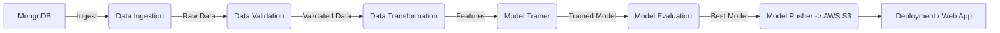

# Vehicle Price Prediction - End-to-End MLOps Pipeline

## 📌 Project Overview

This project is a comprehensive **End-to-End Machine Learning** solution designed to predict vehicle prices. It demonstrates a production-ready MLOps architecture, transitioning from experimentation (Jupyter Notebooks) to a modular, scalable, and deployable application.

The system features a robust pipeline that handles data ingestion from **MongoDB**, validates data quality, transforms features, trains models, evaluates performance, and automatically deploys the best model to **AWS** using **GitHub Actions** and **Docker**.

## 🚀 Key Features

* **Modular Architecture**: Code is organized into independent components (Ingestion, Validation, Transformation, Training, Evaluation) for maintainability and scalability.
* **Data Pipeline**: Automated data extraction from **MongoDB Atlas** with support for large datasets.
* **CI/CD Implementation**: Fully automated deployment pipeline using **GitHub Actions** to build Docker images and push to **AWS ECR**, followed by deployment to **AWS EC2**.
* **Cloud Integration**: Utilizes **AWS S3** for artifact storage (models, preprocessors) and model registry.
* **Experiment Tracking**: Includes custom logging and exception handling for deep observability.
* **Web Interface**: A user-friendly **Flask** web application for real-time predictions.

## 🛠️ Tech Stack

| Category | Technologies |
| --- | --- |
| **Language** | Python 3.8+ |
| **Machine Learning** | Scikit-Learn, Pandas, NumPy, XGBoost (implied) |
| **Database** | MongoDB Atlas |
| **Cloud Platform** | AWS (S3, EC2, ECR) |
| **Containerization** | Docker |
| **CI/CD** | GitHub Actions |
| **Web Framework** | Flask |
| **Version Control** | Git |

## 🏗️ Architecture

The project follows a standard MLOps pipeline architecture:



## 📂 Project Structure

```bash
mlops-proj-0/
├── .github/workflows/    # CI/CD configurations for AWS
├── config/               # Schema and configuration files
├── notebook/             # Jupyter notebooks for experimentation
├── src/
│   ├── cloud_storage/    # AWS S3 interactions
│   ├── components/       # Core ML components (Ingestion, Training, etc.)
│   ├── configuration/    # DB and Cloud connection setups
│   ├── constants/        # Project-wide constants
│   ├── data_access/      # MongoDB data access layer
│   ├── entity/           # Data classes for config and artifacts
│   ├── pipeline/         # Training and Prediction pipelines
│   ├── logger/           # Custom logging
│   └── exception/        # Custom exception handling
├── static/               # CSS and assets
├── templates/            # HTML templates for Flask app
├── app.py                # Flask application entry point
├── Dockerfile            # Docker configuration
├── requirements.txt      # Python dependencies
└── setup.py              # Package setup

```

## ⚙️ Installation & Setup

### Prerequisites

* Python 3.8+
* MongoDB Atlas Account
* AWS Account (S3, ECR, EC2 access)
* Docker Desktop

### 1. Clone the Repository

```bash
git clone https://github.com/manishjangiriitg/mlops-proj-0.git
cd mlops-proj-0

```

### 2. Create Virtual Environment

```bash
conda create -n venv python=3.8 -y
conda activate venv

```

### 3. Install Dependencies

```bash
pip install -r requirements.txt

```

### 4. Set Environment Variables

Create a `.env` file or export the following variables:

```bash
export MONGODB_URL_KEY="your_mongodb_connection_string"
export AWS_ACCESS_KEY_ID="your_aws_access_key"
export AWS_SECRET_ACCESS_KEY="your_aws_secret_key"
export AWS_DEFAULT_REGION="us-east-1"

```

## 🏃‍♂️ Usage

### Running the Web Application

To start the Flask server locally:

```bash
python app.py

```

Access the app at `http://localhost:5000`.

### Triggering the Training Pipeline

You can trigger the training pipeline directly via the `/train` endpoint in the web app or by running the training script:

```bash
python src/pipeline/training_pipeline.py

```

## 🐳 Docker Support

Build the Docker image:

```bash
docker build -t vehicle-price-predictor .

```

Run the container:

```bash
docker run -p 5000:5000 -e MONGODB_URL_KEY="your_key" vehicle-price-predictor

```

## 🤝 Contributing

Contributions are welcome! Please fork the repository and create a pull request for any feature enhancements or bug fixes.

## 📄 License

This project is licensed under the MIT License - see the [LICENSE](https://www.google.com/search?q=LICENSE) file for details.

---

**Author**: Manish Jangir

**Contact**: [LinkedIn-Id](https://www.linkedin.com/in/manish-jangir-183388250/)